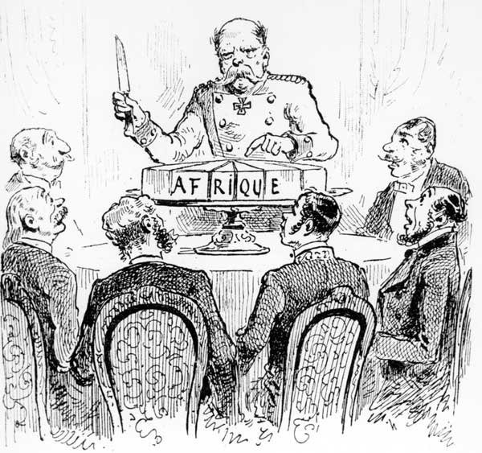
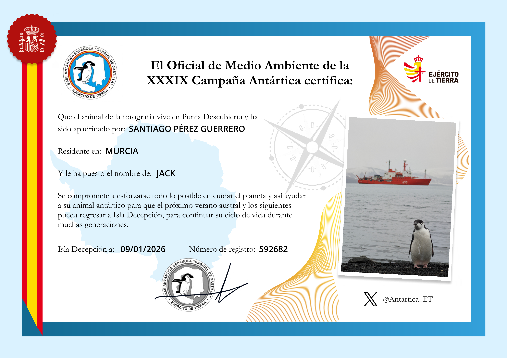
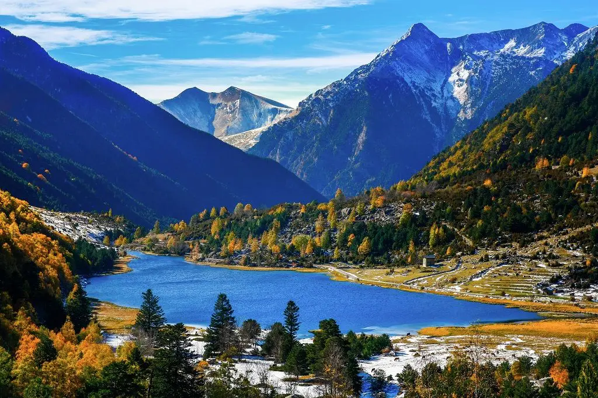
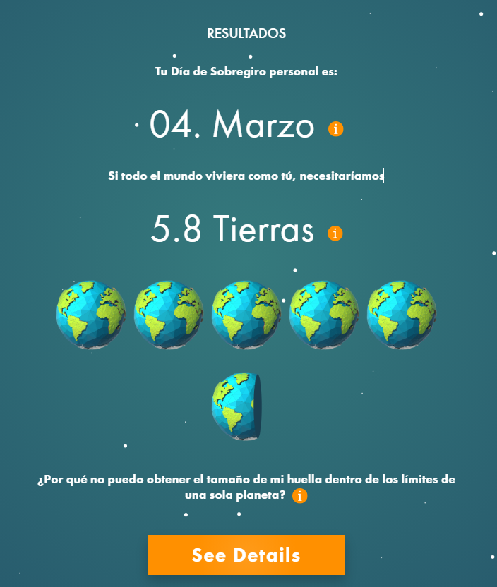
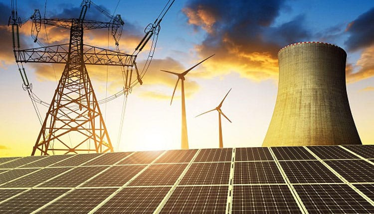

# Sostenibilidad 

### 16/01/2026
Ha explicado la idea de la agenda 2030 y los objetivos de desarrollo sostenible.

- **Agenda 2030:** Es un plan de acción global adoptado por los Estados miembros de las Naciones Unidas en 2015 para erradicar la pobreza, proteger el planeta y garantizar la prosperidad para todos.

Ademas hemos hablado de puntos negativos de la agenda 2030 y puntos positivos.
- Putnos Positivos: conciencia global, cooperación internacional, enfoque integral.
- Puntos Negativos: falta de cumplimiento, financiación insuficiente, desigualdades persistentes.

#### **Pregunta del Dia + Reflexión Personal**
Ni de lejos. Esta Agenda 2030 me parece una utopía. Una construcción ideológica. Parte de la idea de que el mundo funciona a través de valores universales y consensos morales, cuando en realidad funciona a través de poder, recursos y necesidades materiales.

- El objetivo 11: “Ciudades y comunidades sostenibles”, ignora la realidad basica de la concentración masiva de población en ciudades que es una consecuencia directa del sistema económico actual. Pretender que todas las ciudades sean sostenibles mientras crecen sin control es negar la realidad estadistica.

- Puedo decir otro: el objetivo 5: “Igualdad de género”. Depende totalmente del contexto geografico y cultural, religion incluso politico. Muchos lugares la estructura social y cultural no permite la igualdad de genero. Pretender que todos los paises del mundo adopten un mismo modelo de igualdad es una utopia.

Al final, me parece que estos objetivos son mas una suelta al aire de buenas ideas y deseos que una estrategia realista y alcanzable de forma global. Desde mi putnos de vista, estos objetivos no van a fracasar porque sean malos, de hecho pienso que hay algunos que merece la pena, pero no tienen una base en la realidad material del mundo.

Link ded la Pagina: [Pagina Web](https://www.un.org/sustainabledevelopment/es/2015/09/la-asamblea-general-adopta-la-agenda-2030-para-el-desarrollo-sostenible/)

### 09/01/2026
#### **Explicación de la Clase de Hoy**
En la clase del dia de hoy se ha charlado sobre la Contaminación y Residuos

- **Contaminación:** Es la introducción de sustancias o productos en el medio ambiente que causan efectos negativos. Aunque, en realidad, esto no es más que el resultado natural de nuestro sistema económico: consumimos, exprimimos recursos y lo que no nos sirve lo convertimos en un desecho. El problema no es accidental, es estructural

#### **Pregunta del Dia:**
### ¿Cual es el motivo por el que cambiaste el movil?
Lo tuve varios años, al rededor de unos 6 años. La pantalla estaba completamente destrozada, en parte por culpa mía, pero además su software había quedado totalmente obsoleto y ya no recibía actualizaciones. Por ese motivo decidí cambiarlo por uno nuevo, que llevo usando alrededor de cinco años y que sigue funcionando casi perfectamente, además de recibir actualizaciones de forma constante. El modelo anterior era un Huawei P9 Lite.

#### **Reflexión Personal**
En base a mis ideales, creo la contaminacion es un problema serio que los gobiernos deberian afrontar. Pero siendo sinceros, es ingenuo seguir creyendo que les importa algo mas que sus propios intereses y los entes económicos que los sustentan y subencionan, que en su mayoria son los que mueven el mundo. Esta sociedad funciona bajo una misma logica, la del beneficio. 

Todo esto me recuerda una imagen que vi en mi libro de historia. El tema era sobre el reparto de África entre las potencias europeas. En la imagen se veia a los lideres de las potencias europeas en una mesa, con un mapa de Africa en el centro. 

Link de la Pagina: [Pagina Web](https://academiaplay.net/reparto-de-africa/)

En ella se ve a ottos von Bismarck, el canciller alemán, que fue el encargado de organizar la conferencia de Berlín, donde se establecieron las reglas para la colonización y el reparto de África.

#### **Apadrinamiento de un Pingüino**
El ejercito de Tierra Español ha sacado una campaña de apadrinamiento de pingüinos. Te envian un certificado de apadrinamiento y una foto del pingüino que has apadrinado. Obviamente con un tono simbolico, pero me ha parecido una iniciativa interesante y graciosa.

Link de la Pagina: [Pagina Web](https://ejercito.defensa.gob.es/unidades/Antartica/antartica/apadrinamiento/index.html)

### 12/12/2025
#### **Explicación de la Clase de Hoy**
El profesor ha hablado sobre el cambio climatico y perdida de biodiversidad.

- **Cambio Climatico:** alteración a largo plazo de los patrones de temperatura y clima del planeta.
- **Perdida de Biodiversidad:** reducción de la variedad de especies en un ecosistema.

#### **Pregunta del Dia:**
### ¿Cual es el prinpal emiso de CO2 a nivel mundial?
Los principales emisores de CO2 a nivel mundial son: en primer lugar China, seguido de Estados Unidos, India, Rusia y Japon. Que tienen una gran poblacion e industrias que emiten grandes cantidades de CO2 a la atmosfera. Tienen al rededor de 60% de las emisiones globales.

### ¿Cual es el sistema deberia implementar para evitar el colapso ambiental y el cambio climatico?.
Como ya he dicho en anteriores commits, pienso que lo ideal seria un cambio de mentalidad en la sociedad. No un adoctrimaiento en si, pero promoveer una educación ambiental y claras sus consencuencias. Evitar las tipicas ideas de reciclar etc. Algunos ejemplos:
- Aprender a convivir con la naturaleza casi de forma primitiva.
- Aprender a comprar productos locales y de temporada y evitar comprar en monopolios ya que muchas compañas están llevadas por los mismos.

Pero si tuviese que decir un sistema, seria un sistema socioeconomico donde las comunidades recuperaran autonomia y armonia con la naturaleza. 

Link De La Pagina: [Pagina Web](https://www.escapadarural.com/blog/cuanto-sabes-de-la-naturaleza-de-espana/)

**Parque Nacional de Aigüestortes y Estany de Sant Maurici**. Imagen tomada por Oleksandr Katrusha.
Aunque no lo parezca, esta imagen es de España en el Parque Nacional de Aigüestortes y Estany de Sant Maurici. Un lugar espectacular que demuestra la belleza natural que tenemos en nuestro país y que debemos cuidar.

### 05/12/2025
Este dia no he asistido a clase por motivos personales. Aun asi pregunte a compañeros y me dijeron que el profesor hablo sobre la huella de carbono y la huella ecologica. Ademas de calcular tu huella de carbono.

- **Huella de carbono:** Es toda la cantidad de gases de efecto invernadero que una persona emite a la atmosfera.

- **Huella ecologica:** Es la cantidad de recursos naturales que una persona consume en su dia a dia.

 
Aunque segun la pagina web https://www.footprintcalculator.org/home necesitaria **5.8 planetas**. Casi que siento que es un dato absurdo. Mi consumo viene de necesidades estructurales: Tengo que usar mi coche para ir a clase, comprar, entrenar y practicamente vivir. Aun asi compro local, carne de la maxima proximidad y donde se que el animal ha podido vivir bien, huevos, lacteos etc. Todo esto reduce el transporte real. Pienso que el problema no soy tanto yo si no un modelo urbano y social mal diseñado. La organizacion y la infraestructura de pueblos y ciudades dicta el impacto ambiental.  

### 28/11/2025
#### **Explicación de la Clase de Hoy**
Economia circular y economia lineal. 

En cuanto el movelo lineal se basa en tomar, hacer y desecha. Tiene un impacto insostenible en el medio ambiente. En cuanto a datos va a aumentar a un 70% el consumo de recursos en 2050.

Segun la teoria la economia circular que se basa en reducir, reutilizar y reciclar. Ya que la reparacion y reutilizacion de productos reduce el impacto ambiental y mejor para la economia. 

#### **Pregunta del Dia:**
**¿En cuanto a ecodiseño, como me afecta como persona. Ademas que prefieres un efoque mas colectivo: leyes que lo impongan o de forma individual?**

Opino que el ecodiseño puede ayudar a reducir un poco el impactio ambiental. Pero no es la solucion definitiva. Ya que seria una situación "ideal" en la que todos los productos fueran ecodiseñados. Pero ademas se necesita un cambio de mentalidad en la sociedad. En una situacion "ideal" creo que seria importante que el gobierno impusiera leyes que obligaran a las empresas a ecodiseñar sus productos y ademas paises como china,  Estados Unidos, etc. que son los mayores contaminantes del mundo tambien se unieran a este cambio, porque esos dos paises ya crean aproximadamente un 35% de la producción mundial.

Por lo que pienso que se debe implementar en escuelas, universidades, incluso padres que enseñen a sus hijos como funciona la reutilización. La importancia de cuidar el medio ambiente y que todos debemos aportar nuestro granito de arena. Y no en tanto en ecodiseño si no en reducir el consumo de productos innecesarios, reutilizar y reciclar. 

### 21/11/2025
Este día no hubo clase. 

### 14/11/2025
#### **Explicación de la Clase de Hoy**
En esta clase el profesor ha hablado sobre como organizar nuestro README y que ahora debemos añadir una imagen en el.md

Tambien ha hablado sobre el analisis del ciclo de vida:
Puso el ejemplo de un telefono movil. ¿Como es posible el peso oculto de un telefono movil? Ya que la fabricacion del movil son unos 80kg pero el producto final son unos pocos gramos. Por lo que para fabricar un movil se necesitan muchos recursos naturales y energia (silicio, litio, cobre, etc).

Luego ha hablado sobre tipos de energia: Energia nuclear, hidraulica, eolica, solar, etc.

#### **Pregunta del Dia:**
Le pregunte a la IA lo siguiente: **ANÁLISIS DEL CICLO DE VIDA 
Chuletón de Vaca Madurada y su PESO OCULTO**

#### **Reflexión Personal**
En mi opinion las mejores fuentes de energia son la nuclear. Ya que es una fuente de energia muy potente y con un bajo impacto ambiental en cuanto a emisiones de CO2. A pesar de los riesgos que conlleva, sigue siendo la mejor la opcion para reducir las emisiones de gases de efecto invernadero y optener la mejor eficacia. 

El chuletón de vaca madurada tiene una mochila ecológica enorme: producir 

- 1 kg requiere 15.000-20.000 L de agua
- 25-30 kg de alimento
- 330 m² de tierra 
- genera 25-35 kg de CO₂eq

Siendo la cría del ganado el 80% del impacto (metano, fertilizantes, suelo y energía). La maduración añade consumo eléctrico constante y pérdidas del 15-30% de peso, mientras que el transporte refrigerado, el envasado plástico y la cadena de frío incrementan aún más la huella. 

En conjunto, por cada kg visible hay unos 60 kg de recursos ocultos. Es un producto de alto valor gastronómico pero con un impacto ambiental muy elevado; lo responsable es origen local, ganadería sostenible y aprovechar todo el producto.

### 07/11/2025
Este día no hubo clase. 

### 31/10/2025
Recursos limitados y el consumo creciente del humano en La Tierra.
El ciclo cerrado de la biosfera (agua, carbono, materiales) y sobre todo de como se ha usasado el agua a lo largo del tiempo y ahora. Ademas nos ha dicho dar una idea sobre 
sostenibilidad e incluirlo en la bitacora grupal

### 24/10/2025
En esta clase ha hablado sobre la estrategia K y R. Sobre la natalidad, evolucion de los seres vivos etc. 

- **Estrategia R:** Se basa en producir muchas crías, pero con poca inversión en cada una

- **Estrategia K:** Produce pocas crías, pero con gran inversión de cuidado y recursos.

Ademas ha lanzado una pregunta de hoy es que que estrategia seguimos hoy en dia: 

De forma clara seguimos la estrategia K. Tenemos una baja natalidad pero una mayor probabilidad de supervivencia. Sobre todo en españa en la que nuestra poblacion esta avanzada en edad. Aunque en otro paises ya sea India o China tienen una mayor natalidad a pesar de esto siguen una estrategia K.

### 17/10/2025
Ha lanzado la pregunta de si vivimos solos. Es retórica, claro: obviamente no vivimos solos. En clase se dijo que vivimos con diferentes especies. Posteriormente surgió la cuestión: ¿Qué hacemos nosotros como seres humanos, cooperamos o competimos?

Nosotros cooperamos en un rango determinado de personas pero competimos con otros. Al final esas relaciones de cooperacion estan basadas en un interes común. Sin embargo, incluso dentro de esa cooperación existen intereses personales y cierta avaricia por destacar o conseguir algo dentro del propio equipo. 

Un ejemplo sencillo pero práctico es el de una empresa: las personas cooperan para que funcione, pero al mismo tiempo compiten entre sí por obtener un mejor puesto, los cuales son limitados. Además, la empresa en conjunto compite con otras empresas.

Es casi una especie de bucle: todos competimos entre nosotros, pero a la vez necesitamos cooperar para avanzar. Es una dinámica algo extraña

### 10/10/2025
El día de hoy, el profesor ha hablado sobre la **capacidad de carga**, poniendo como ejemplo la evolución bacteriana en un entorno y su curva de “natalidad”. Estas bacterias generan un ecosistema favorable para su desarrollo y comienzan a crecer de forma acelerada, hasta alcanzar un punto límite en el que el entorno deja de poder sostener un aumento adicional de población. A partir de ese instante, el sistema entra en equilibrio con la cantidad de individuos que el medio es capaz de mantener.

Este fenómeno es comparable con lo que ocurre con los seres humanos. También dependemos de recursos limitados de forma natural. Si sobrepasamos la capacidad de carga del planeta, se generan problemas como la escasez de recursos, la sobrepoblación y el deterioro ambiental, lo que pone en riesgo nuestro equilibrio como especie

#### 03/10/2025
Se ha hablado sobre las diferencias entre humanos y animales. Ademas lo hemos debatido entre la clase proponiendo suposiciones e ideas.

El profesor nos ha lanzado la siguiente pregunta para responder: 

¿Acabaremos con la vida de nuestro planeta?  
No, en mi opinión no podemos suprimir la vida de nuestro planeta ni en el caso de una guerra mundial. En nuestra historia la humanidad ha demostrado una gran capacidad de resistencia y adaptación. Pienso, que las grandes potencias ni si quiera tienen un interes en destrozarlo. Su poder y estabilidad dependen de otros paises y hacer de un pais una autarquia es algo complicado. 

Por otra parte lo unico que podria acabar con nosotros no somos en si nosotros si no catastrofes naturales, ya sea un impacto de un meteorito, un fenomeno cosmico etc. 

En cuanto a mi clonclusión, es muy dificil pensar que la humanidad pueda acabar con **toda** la vida del planeta

#### 26/09/2025
En este día no he podido asistir a clase, pero he podido preguntar a un compañero y me ha comentado que cada fila de la clase tiene que hacer un repositorio publico en git. 

#### 19/09/2025 
En esta primera clase se nos ha introducido al modulo. 
En el que hemos visto los siguiente puntos:

* Metodologia
* Criterios de Evaluación y Calificación

En cuanto a la metodologia ha comentado que el trabajo mas importante será en grupo en el que crearemos una **pagina web** sobre alguna civilación. 

> Trabajo Academico Sostenibilidad Curso 2025-2026